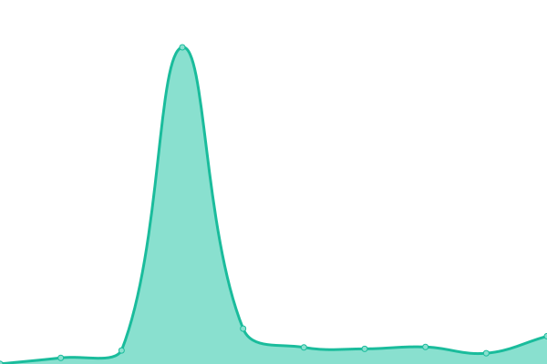
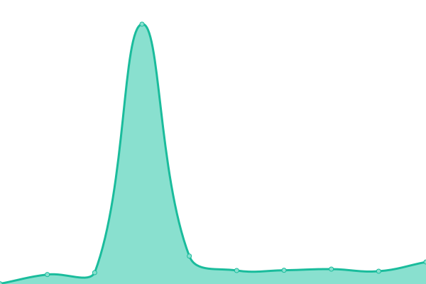
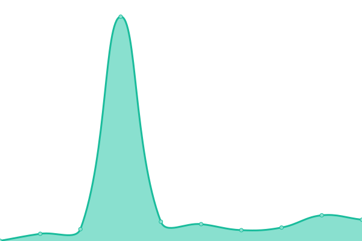
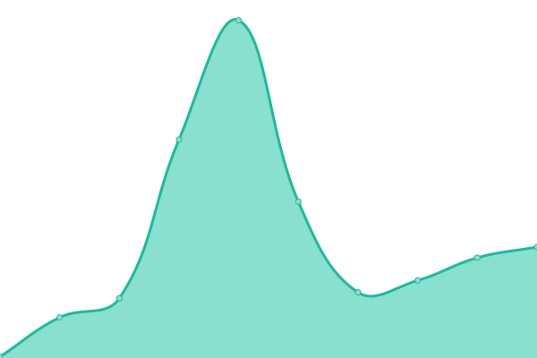

# [📈 Live Status](https://Rover-95.github.io/Up-time): <!--live status--> **🟧 Partial outage**

This repository contains the open-source uptime monitor and status page for [Rover 95](https://Rover-95.github.io/Up-time), powered by [Upptime](https://github.com/upptime/upptime).

With [Upptime](https://upptime.js.org), you can get your own unlimited and free uptime monitor and status page, powered entirely by a GitHub repository. We use [Issues](https://github.com/Rover-95/Up-time/issues) as incident reports, [Actions](https://github.com/Rover-95/Up-time/actions) as uptime monitors, and [Pages](https://Rover-95.github.io/Up-time) for the status page.

<!--start: status pages-->
<!-- This summary is generated by Upptime (https://github.com/upptime/upptime) -->
<!-- Do not edit this manually, your changes will be overwritten -->
<!-- prettier-ignore -->
| URL | Status | History | Response Time | Uptime |
| --- | ------ | ------- | ------------- | ------ |
|  [Rover 95 Website](rover95.vercel.app) | 🟩 Up | [rover-95-website.yml](https://github.com/Rover-95/Up-time/commits/HEAD/history/rover-95-website.yml) | 

 171ms
     
 | 

<a href="https://Rover-95.github.io/Up-time/history/rover-95-website">100.00%</a>
    

|  [Rover 95 FORUMS](http://147.185.221.194:63491/forum/index.php?forums/) | 🟥 Down | [rover-95-forums.yml](https://github.com/Rover-95/Up-time/commits/HEAD/history/rover-95-forums.yml) | 

 0ms
     
 | 

<a href="https://Rover-95.github.io/Up-time/history/rover-95-forums">0.00%</a>
    

|  [Zell Website Demo](https://zell.vercel.app) | 🟩 Up | [zell-website-demo.yml](https://github.com/Rover-95/Up-time/commits/HEAD/history/zell-website-demo.yml) | 

 132ms
     
 | 

<a href="https://Rover-95.github.io/Up-time/history/zell-website-demo">100.00%</a>
    

|  [Zell Craft SERIES](147.185.221.212:31163) | 🟥 Down | [zell-craft-series.yml](https://github.com/Rover-95/Up-time/commits/HEAD/history/zell-craft-series.yml) | 

 0ms
     
 | 

<a href="https://Rover-95.github.io/Up-time/history/zell-craft-series">0.00%</a>
    

|  [Exprite Website](https://exprite.vercel.app/) | 🟩 Up | [exprite-website.yml](https://github.com/Rover-95/Up-time/commits/HEAD/history/exprite-website.yml) | 

 93ms
     
 | 

<a href="https://Rover-95.github.io/Up-time/history/exprite-website">100.00%</a>
    

|  [Exprite EZ FTP](http://147.185.221.180:60054/) | 🟥 Down | [exprite-ez-ftp.yml](https://github.com/Rover-95/Up-time/commits/HEAD/history/exprite-ez-ftp.yml) | 

 0ms
     
 | 

<a href="https://Rover-95.github.io/Up-time/history/exprite-ez-ftp">0.00%</a>
    

|  [Reink Hosting](https://reink.vercel.app/) | 🟥 Down | [reink-hosting.yml](https://github.com/Rover-95/Up-time/commits/HEAD/history/reink-hosting.yml) | 

 95ms
     
 | 

<a href="https://Rover-95.github.io/Up-time/history/reink-hosting">0.00%</a>
    

<!--end: status pages-->

[**Visit our status website →**](https://Rover-95.github.io/Up-time)

## 📄 License

- Powered by: [Upptime](https://github.com/upptime/upptime)
- Code: [MIT](./LICENSE) © [Rover 95](https://Rover-95.github.io/Up-time)
- Data in the `./history` directory: [Open Database License](https://opendatacommons.org/licenses/odbl/1-0/)
